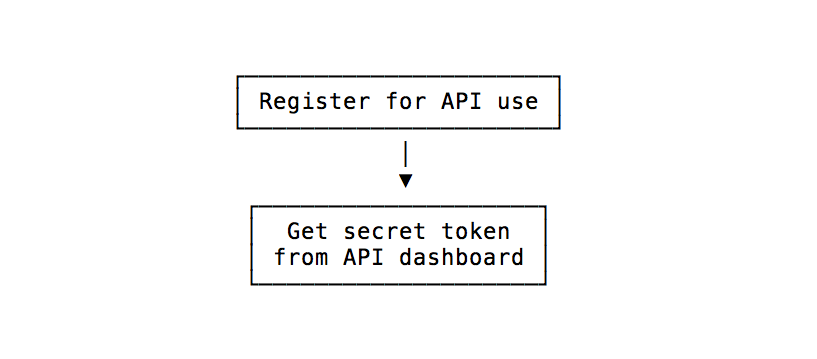

# INTRODUCTION

A JWT technically is a mechanism to verify the owner of some JSON data. It’s an encoded string, which is URL safe, that can contain an unlimited amount of data (unlike a cookie), and it’s cryptographically signed.

When a server receives a JWT, it can guarantee the data it contains can be trusted because it’s signed by the source. No middleman can modify a JWT once it’s sent.

It’s important to note that a JWT guarantees data ownership but not encryption; the JSON data you store into a JWT can be seen by anyone that intercepts the token, as it’s just serialized, not encrypted. For this reason, it’s highly recommended to use HTTPS with JWTs (and HTTPS in general, by the way).

# JWT STRUCTURE

JWT is composed of 3 parts which are separated by the dot sign "."

* Header
* Payload
* Signature

## Header

Header is representative for data type and the algorithm being used.

```
{
    "typ": "JWT",
    "alg": "HS256"
}
```

* “typ” (type) : datatype is JWT
* “alg” (algorithm) : encoding algorithm is HS256

## Payload

## Signature


# When to use JWT

JWT is a great technology for API authentication and server-to-server authorization.

It’s not a good choice for sessions.

## Using JWT for API authentication

A very common use of a JWT token, and the one you should probably only use JWT for, is as an API authentication mechanism.


