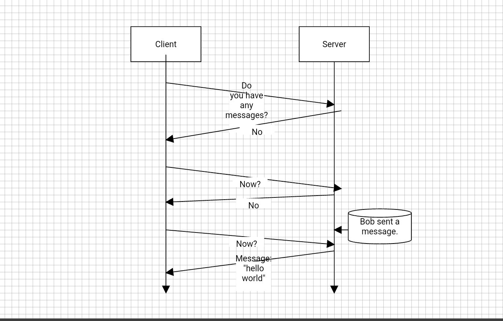

# What is websocket

Websocket is bi-directional communication protocol over web that helps client to server and server to client communication on single TCP connection and on same port.

# What is the use of Websocket and how it is helpful? 

## How things works before Websocket ?

For communication on web, HTTP is the standard protocol that is used.

HTTP is stateless protocol. It means,

1. Client Request connection

2. Connection established

3. Client sends a request.

4. Server gives response.

5. Connection closed

Now client and server are independent and unaware of each other. If client want to communicate again then it has to again go with above steps. Also, request is always initiated by client and server can't initiate communication.

**So, if Server has to say something to the client then how to achieve that?**

First of all, why server want to communicate with the client, Lets see below example,

1. Say, Jayesh requested for fare information of Flight number MH 198 from Mumbai to Ahmedabad.

2. Server responded to Jayesh "Price is 5000 INR."

3. Jayesh is thinking whether to book a flight at 5000 INR and then finally after 5 minutes, he made a mind to book it.

4. Now after filling long form of passenger list and other flight information, when Jayesh pressed the "Book" button, he found that now Flight price is 6000 INR, how this happen??????????

5. Jayesh is frustrated and thinking why server not notified him before filling the long form on passenger list.

Ideally, Server should notify Jayesh that flight price is changed, please refresh the page. 
But how the server will know that to which all clients he need to inform and top of all, Server doesn't know any information on client.

This is possible only if server is capable of identifying client that, "who all client are connected to server and notify them on updates".

As communication happens over HTTP, before Websocket, Server notify to the client using below techniques,

Home » AngularJS » Java » What is Websocket? How Websocket works? Program on updating total count of connected Clients.
What is Websocket? How Websocket works? Program on updating total count of connected Clients.
in AngularJS, Java - on 11:48:00 - 2 comments
What is Websocket?
Websocket is bi-directional communication protocol over web that helps client to server and server to client communication on single TCP connection and on same port.

What is the use of Websocket and how it is helpful?
How things works before Websocket ?
For communication on web, HTTP is the standard protocol that is used.

HTTP is stateless protocol. It means,

    1. Client Request connection
    2. Connection established
    3. Client sends a request.
    4. Server gives response.
    5. Connection closed
Now client and server are independent and unaware of each other.
If client want to communicate again then it has to again go with above steps,
Also, request is always initiated by client and server can't initiate communication.

So, if Server has to say something to the client then how to achieve that?

First of all, why server want to communicate with the client, Lets see below example,

   1. Say, Jayesh requested for fare information of Flight number MH 198 from Mumbai 
       to Ahmedabad. 
   2. Server responded to Jayesh "Price is 5000 INR."
   3. Jayesh is thinking whether to book a flight at 5000 INR and then finally after 5 minutes,
        he made a mind to book it.
   4. Now after filling long form of passenger list and other flight information, 
       when Jayesh pressed the "Book" button, he found that now Flight price is 6000 INR, 
       how this happen??????????
   5. Jayesh is frustrated and thinking why server not notified him before filling the long form 
       on passenger list.

Ideally, Server should notify Jayesh that flight price is changed, please refresh the page. 
But how the server will know that to which all clients he need to inform and top of all, Server doesn't know any information on client.
This is possible only if server is capable of identifying client that, "who all client are connected to server and notify them on updates".

As communication happens over HTTP, Before Websocket, Server notify to the client using below techniques,

1. Polling

    In this technique,

    * Client requests a webpage from a server using regular HTTP request.
    * The requested webpage executes JavaScript which requests for updates from the server at regular intervals (say 1 seconds).
    * The server checks for updates and responds back, just like normal HTTP response.

    In Polling, client continuously polls server at regular intervals, asking is there any updates for client?

    **Disadvantage**: if there is no updates, then unnecessarily client sends request to server and it hits server performance.

2. Long Polling

    In this technique,

    * A client requests a webpage from a server using regular HTTP request.
    * The requested webpage executes JavaScript which requests for updates from the server.
    * Now if server does not have any updates, then server does not immediately responds telling "no update" instead waits until there's new information available. When there's update available, the server responds with the updated information that help client on information say price has changed.
    * The client receives updated price information and immediately sends another request to the server, re-starting the process.

    **Disadvantage**: Server like Tomcat would spawned thread to handle for each request, that reserve resources, till its done. So the traffic is smaller, but eats resources fast (also block resources).

## HTTP vs Websocket

HTTP protocol: A request is needed to respond. Clients need to constantly ask the server if there are new messages in order to receive them.

Web Sockets on the other hand don’t need clients to send a request in order to respond. They allow bidirectional data flow so clients just have to listen for any data.

Clients can just listen to the server and it will send clients a message when it’s available. Seems more practical, right? And it is…

## What is the web socket good for?

* Real-time applications
* Chat apps
* IoT (internet of things)
* Online multiplayer games

# References

* https://medium.com/free-code-camp/million-websockets-and-go-cc58418460bb
<!-- * https://viblo.asia/p/hieu-hon-ve-websocket-znVGL2r0RZOe -->
<!-- * https://yalantis.com/blog/how-to-build-websockets-in-go/ -->
* https://tutorialedge.net/golang/go-websocket-tutorial/