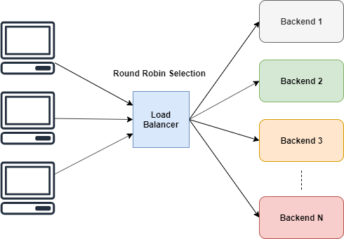
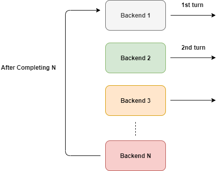

# Simple Load Balancer with Go

## Introduction

Load Balancers play a key role in web architecture by distributing the load to a group of backend servers. This makes services more scalable and more reliable. Also, since there are multiple backends configured, the service become highly available because the load balancer can fix a working server in case of a failure.

## How does simple load balancer work

Load Balancers have different strategies for distributing the load across a set of backends.

- **Round Robin** — Distribute load equally, assumes all backends have the same processing power

- **Weighted Round Robin** — Additional weights can be given considering the backend’s processing power

- **Least Connections** — Load is distributed to the servers with least active connections



### Round Robin Selection

Round Robin is simple. It gives equal opportunities for workers to perform tasks in turns.



As shown in the figure about this happens cyclically. But we can’t directly use that aren’t we?

What if a backend is down? We probably don’t want to route traffic there. So this cannot be directly used unless we put some conditions on it. We need to route traffic only to backends which are up and running.

### Use of the ReverseProxy

As we already identified, the sole purpose of the load balancer is to **route traffic** to different backends and return the results to the original client.

According to Go’s documentation:

```
ReverseProxy is an HTTP Handler that takes an incoming request and sends it to another server, proxying the response back to the client.
```

Which is exactly what we want. There is no need to reinvent the wheel. We can simply relay our original requests through the ReverseProxy.

```
u, _ := url.Parse("http://localhost:8080")
rp := httputil.NewSingleHostReverseProxy(u)
// initialize your server and add this as handler
http.HandlerFunc(rp.ServeHTTP)
```

With httputil.NewSingleHostReverseProxy(url) we can initialize a reverse proxy which would relay requests to the passed url. In the above example, all the requests are now passed to localhost:8080 and the results are sent back to the original client.

### Selection Process

We need to skip dead backends during the next pick. But to do anything we need a way to count.

Multiple clients will connect to the load balancer and when each of them requests a next peer to pass the traffic on race conditions could occur. To prevent it we could lock the ServerPool with a mutex. But that would be an overkill, besides we don't want to lock the ServerPool at all. We just want to increase the counter by one

To meet that requirement, the ideal solution is to make this increment atomically. And Go supports that well via atomic package.

```
// NextIndex atomically increase the counter and return an index
func (s *ServerPool) NextIndex() int {
   return int(atomic.AddUint64(&s.current, uint64(1)) % uint64(len(s.backends)))
}
```

In here, we are increasing the current value by one atomically and returning the index by modding with the length of the slice. This means the value will always be between 0 and length of the slice. In the end, we are interested in a particular index, not the total count.

### Picking an alive backend

We already know that our requests are routed in a cycle for each backend. All we have to skip dead ones, that’s it.

GetNext() always return a value that's capped between 0 and the length of the slice. At any point, we get a next peer and if it's not alive, we would have to search through the slice in a cycle.

### Avoid Race Conditions in Backend struct

There is a serious issue we need to consider. Our Backend structure has a variable which could be modified or accessed by different goroutines same time.


## References:

- https://levelup.gitconnected.com/create-a-simple-load-balancer-with-go-4b474460bab2

- https://github.com/d12/Load-Balancer-Golang/blob/master/proxy.go
